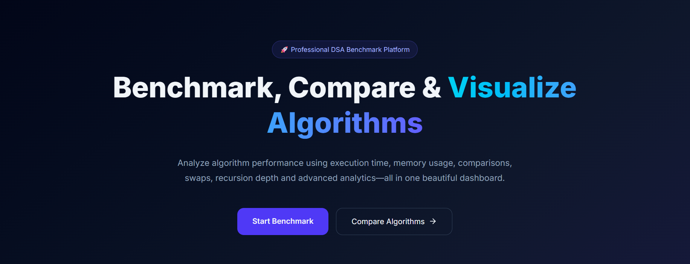
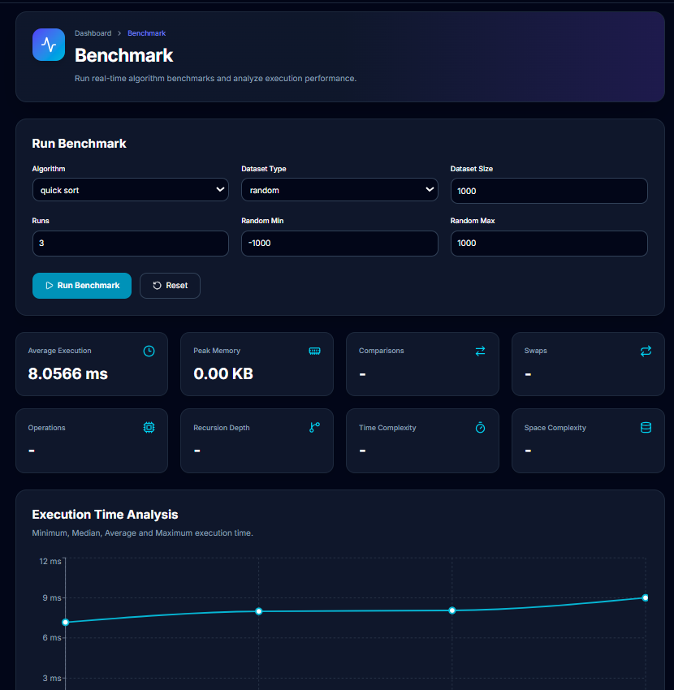
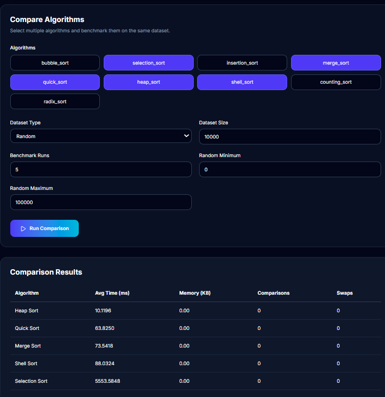
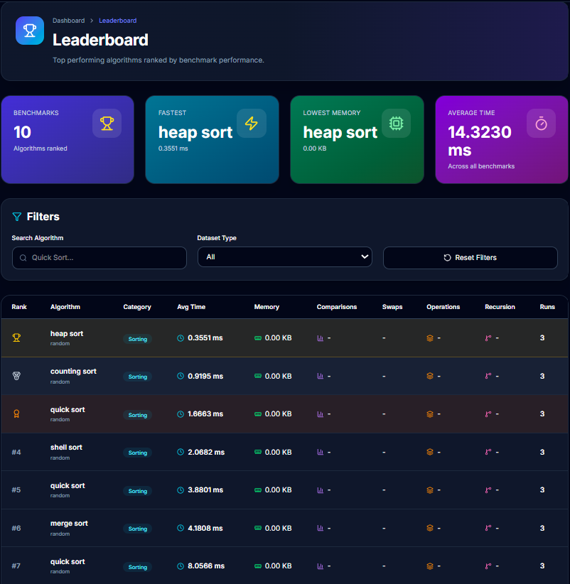
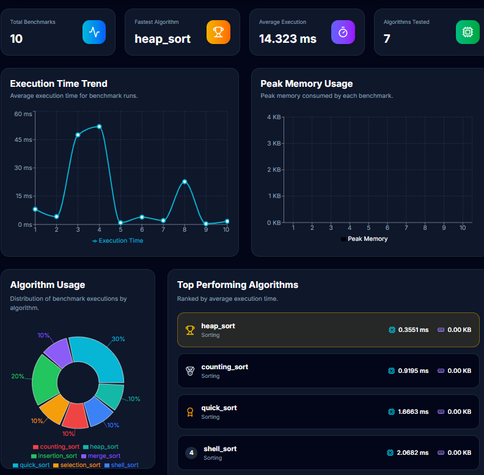

# 🚀 DSA Benchmark Studio

A modern full-stack benchmarking platform for analyzing the real-world performance of Data Structures and Algorithms. Built with **Next.js**, **FastAPI**, and **Python**, the application allows users to benchmark algorithms, compare results, visualize performance metrics, manage benchmark history, and export reports in multiple formats.

---

## 📌 Overview

DSA Benchmark Studio bridges the gap between theoretical algorithm complexity and practical execution by measuring actual runtime and memory usage under different datasets.

Users can:

- Run benchmarks on various algorithms
- Compare multiple algorithms
- Visualize execution metrics
- Store benchmark history
- Export reports as CSV, JSON, PDF, and Excel

---

## ✨ Features

### ⚡ Benchmark Algorithms

- Execute algorithms on different datasets
- Configure dataset size
- Run multiple benchmark iterations
- Measure execution time and memory usage

### 📊 Performance Analytics

- Average Execution Time
- Minimum Execution Time
- Maximum Execution Time
- Median
- Standard Deviation
- Peak Memory Usage

### 📈 Interactive Dashboard

- Performance charts
- Benchmark summaries
- History statistics
- Algorithm comparison

### 📝 Benchmark History

- Persistent benchmark records
- Search previous benchmarks
- Delete history
- View benchmark details

### 📤 Export Reports

Supports exporting benchmark data as:

- CSV
- JSON
- PDF
- Excel (.xlsx)

---

# 🛠 Tech Stack

## Frontend

- Next.js 16
- React
- TypeScript
- Tailwind CSS
- Axios
- Recharts
- Lucide React

## Backend

- FastAPI
- Python
- Pydantic
- ReportLab
- OpenPyXL

---

# 📂 Project Structure

```text
DSA-Benchmark-Studio
│
├── backend
│   ├── app
│   │   ├── api
│   │   ├── algorithms
│   │   ├── schemas
│   │   ├── services
│   │   ├── exports
│   │   └── history
│   ├── requirements.txt
│   └── main.py
│
├── frontend
│   ├── src
│   │   ├── app
│   │   ├── components
│   │   ├── services
│   │   ├── types
│   │   └── hooks
│   └── package.json
│
└── README.md
```

---

# 🚀 Getting Started

## Clone Repository

```bash
git clone https://github.com/YOUR_USERNAME/DSA-Benchmark-Studio.git
cd DSA-Benchmark-Studio
```

---

## Backend Setup

```bash
cd backend

python -m venv .venv

# Windows
.venv\Scripts\activate

# Linux/Mac
source .venv/bin/activate

pip install -r requirements.txt

uvicorn app.main:app --reload
```

Backend runs at:

```
http://127.0.0.1:8000
```

Swagger Documentation:

```
http://127.0.0.1:8000/docs
```

---

## Frontend Setup

```bash
cd frontend

npm install

npm run dev
```

Frontend runs at

```
http://localhost:3000
```

---

# 📡 API Endpoints

## Benchmark

```
POST /api/benchmark
```

Runs a benchmark.

---

## Compare Algorithms

```
POST /api/comparison
```

Compares multiple algorithms.

---

## Benchmark History

```
GET /api/history
```

Returns benchmark history.

---

## Export Report

```
POST /api/export
```

Generates an export.

```
GET /api/export/download/{filename}
```

Downloads the generated report.

---

## Export Statistics

```
GET /api/export/stats
```

Returns export statistics.

---

# 📊 Supported Export Formats

- CSV
- JSON
- PDF
- Excel (.xlsx)

---

# 📸 Screenshots

> Add screenshots after deployment.

### Dashboard



### Benchmark



### Comparison



### Leaderboard



### Analytics



---

# 💡 Key Concepts Implemented

- REST API Development
- FastAPI
- Next.js App Router
- TypeScript
- Data Structures & Algorithms
- Performance Benchmarking
- Statistical Analysis
- File Generation
- PDF Reports
- Excel Reports
- Responsive UI
- Modular Architecture

---

# 🎯 Future Improvements

- User Authentication
- Cloud Database
- Real-Time Benchmark Execution
- Dark/Light Theme
- Docker Support
- CI/CD Pipeline
- Leaderboards
- AI-Based Performance Insights

---

# 👨‍💻 Author

**Atharv Dhupkar**

- GitHub: https://github.com/atharv-dhupkar22
- LinkedIn: https://www.linkedin.com/in/atharv-dhupkar-ba2895286/

---

# ⭐ Support

If you found this project useful, consider giving it a ⭐ on GitHub!
